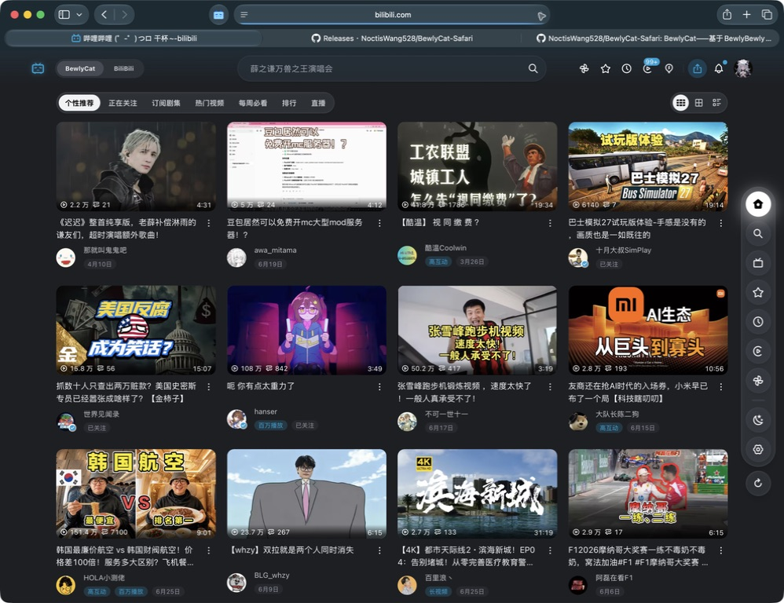

<p align="center">
  
</p>

<h1 align="center">BewlyCat-Safari</h1>

<p align="center">
  为 macOS Safari 适配的 Bilibili 首页增强扩展。
</p>

<p align="center">
  <a href="https://github.com/NoctisWang528/BewlyCat-Safari/releases/latest">
    
  </a>
  <a href="https://github.com/NoctisWang528/BewlyCat-Safari/actions/workflows/ci.yml">
    
  </a>
  
  
  <a href="./LICENSE">
    
  </a>
</p>

> [!IMPORTANT]
> 本仓库只维护和发布 macOS Safari 版本，不提供 Chrome、Edge 或 Firefox
> 构建。Safari Web Extension 需要随 macOS 宿主 App 安装，不能直接加载
> Chromium 扩展压缩包。

## 项目简介

BewlyCat-Safari 将 BewlyCat 的页面体验迁移到 Safari，并针对 Safari Web
Extension 的权限、脚本注入、后台生命周期、登录请求和 Xcode 打包流程进行
专门适配。

它保留了重新设计的 Bilibili 首页、顶栏、侧边 Dock、视频卡片、播放体验和
个性化设置，同时让这些功能能够在 Safari 的扩展模型下稳定运行。

## 界面预览



## Safari 适配

- **Safari MV3 构建**：仓库的正式构建目标固定为 Safari，生成独立的
  `extension-safari/` WebExtension bundle。
- **MAIN-world 桥接**：通过网页脚本和受限消息协议完成 Safari 不支持的
  MAIN world 声明式注入，包括登录态稍后再看请求。
- **请求兼容层**：针对 Bilibili API 的 Cookie、CSRF、Origin、Referer 和
  Safari DNR 行为进行隔离处理。
- **后台生命周期**：使用 alarms 和持久化状态适配 Safari 非持久后台页。
- **Xcode 资源同步**：源码构建后可刷新现有 Xcode Resources，不覆盖 Team、
  bundle identifier 或签名配置。
- **三处 bundle 校验**：可检查源码产物、Xcode Resources 与最终 App 内嵌
  扩展是否逐文件一致，避免 Safari 继续加载旧 bundle。

更完整的实现说明见 [Safari 构建与维护文档](./docs/SAFARI.md)。

## 功能概览

- 重新设计的 Bilibili 首页、顶栏和侧边 Dock
- 个性推荐、关注动态、热门、排行、直播等首页入口
- 视频卡片预览、稍后再看、收藏及后台打开
- 播放器样式、自动播放、倍速记忆、音量均衡等增强
- 深色模式、主题色、壁纸与界面布局设置
- 设置导入、导出和本地持久化
- 面向 Safari 的登录态 API 与页面脚本兼容

功能会随上游 BewlyCat 正式版本按需同步，但 Safari 兼容性和发布节奏由本仓库
独立维护。

## 安装

1. 打开 [Releases](https://github.com/NoctisWang528/BewlyCat-Safari/releases/latest)。
2. 下载 `BewlyCat-Safari-vX.Y.Z-safari.N-macOS.zip` 和
   `SHA256SUMS.txt`。
3. 校验 SHA-256，解压后将 `BewlyCat Safari.app` 移入“应用程序”。
4. 打开宿主 App，然后前往 Safari → 设置 → 扩展。
5. 启用 BewlyCat，并授予 Bilibili 与相关静态资源域名的网站访问权限。

如果 Release 未使用 Developer ID 签名或未经过 Apple notarization，macOS
可能显示 Gatekeeper 警告。每个 Release 的实际签名状态以对应发布说明为准。

## 版本规则

公开版本采用：

```text
v<上游版本>-safari.<Safari 修订号>
```

例如：

```text
v1.6.7-safari.1
v1.6.7-safari.2
v1.6.7-safari.3
v1.6.8-safari.1
```

- `1.6.7` 表示跟随的 BewlyCat 上游基线。
- `safari.3` 表示本仓库在该基线上的第 3 个 Safari Release。
- Safari 修订号只在发布时增加；普通提交不单独占用版本号。
- Xcode `MARKETING_VERSION` 跟随上游基线，`CURRENT_PROJECT_VERSION`
  作为 build number 持续递增。

## 本地构建

### 环境要求

- macOS
- Node.js LTS
- `pnpm@10.21.0`
- Xcode 27 Beta：`/Applications/Xcode-beta.app`

### 构建 Safari WebExtension

```bash
pnpm install --frozen-lockfile
pnpm lint
pnpm typecheck
pnpm test
pnpm build
pnpm validate-safari
```

### 创建或刷新 Xcode 工程

首次创建：

```bash
pnpm package-safari
```

已经配置过签名的日常开发工程应使用：

```bash
pnpm sync-safari-xcode
```

Xcode clean build 后检查三处资源：

```bash
pnpm check-safari-xcode-sync
```

详细步骤、签名、打包和故障排查见
[docs/SAFARI.md](./docs/SAFARI.md)。

## 上游维护

上游代码仅在确认需要跟进的正式 Release 节点手动合并，不自动跟踪
`upstream/main`。同步时会保留本仓库的 Safari manifest、MAIN-world 桥、
DNR、后台生命周期和 Xcode 打包逻辑。

维护流程见
[上游同步与维护手册](./docs/UPSTREAM-MAINTENANCE-cmn_CN.md)。

## 反馈与贡献

- Safari 适配问题和本仓库 Release：
  [Issues](https://github.com/NoctisWang528/BewlyCat-Safari/issues)
- 开发约定：
  [贡献指南](./docs/CONTRIBUTING-cmn_CN.md)

提交问题时请附上 macOS、Safari、Xcode 和 BewlyCat-Safari 的准确版本，以及
能够复现问题的步骤。请勿公开 Cookie、CSRF、access token 或其他登录凭据。

## 致谢

- [keleus/BewlyCat](https://github.com/keleus/BewlyCat)：本项目的上游基础
- [BewlyBewly](https://github.com/BewlyBewly/BewlyBewly)：原始项目与历史贡献者
- [Bilibili-Evolved](https://github.com/the1812/Bilibili-Evolved)
- [bilibili-API-collect](https://github.com/SocialSisterYi/bilibili-API-collect)
- [vitesse-webext](https://github.com/antfu/vitesse-webext)

本项目遵循上游 [Custom License](./LICENSE)，使用、修改与分发时请遵守其中的限制。
